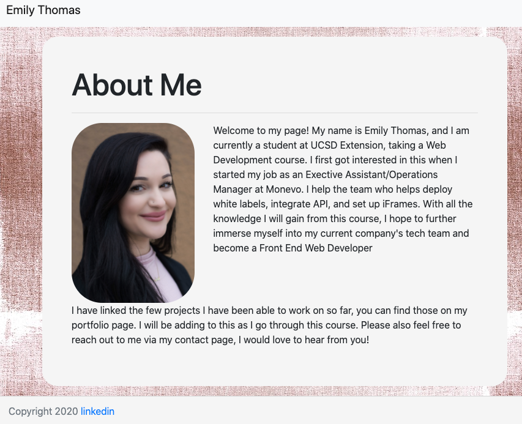

# Welcome to my Portfolio! 🙂
  

## Description
This project helped me learn how to utilize bootstrap, and how to grid within your html.  I struggled at first but once I understood how the gridding system worked, it really is a fantastic tool to use to create a basic webpage.  Bootstrap has a huge list of classes to customize almost everything.  I did also add my own css style file to override and customize some of the bootstrap. 

The most challenging portion of this project was to make sure the pages were responsive, but utilizing the fluid classes and my own css I was able to get all pages to be responsive.  I also will be adding to this page as I progress through this course, and filling in the portfolio page with more of my work!  I have linked my webpage below, check it out!

## Webpage & LinkedIn Link
[My Webpage](https://ethomas22.github.io/My-Portfolio/)
 
[LinkedIn](https://www.linkedin.com/in/emily-t-508ab7100/)

## Credits
Thank you for all your help and Support!
 
[Christina](https://github.com/Christina2021)
 
[Ravi](https://github.com/ravifindravicom)
 
[Brian](https://github.com/btparker70)
 
[Dillon](https://github.com/dillonhoban)
 
## License
[MIT License](https://opensource.org/licenses/MIT)
